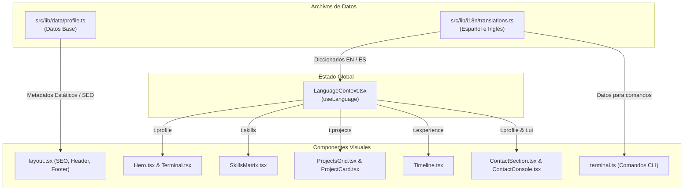

# 🧭 Guía Maestra del Proyecto: Arquitectura, Componentes y Flujo de Datos

> **Propósito de este documento:**  
> Esta guía fue diseñada específicamente para resolver el problema de ver "demasiados datos en el frontend sin contexto". Aquí encontrarás el mapa completo del portafolio: qué hace cada carpeta, por qué los datos están organizados como están, y exactamente **dónde y cómo modificar cualquier parte del proyecto** sin perderte.

---

## 📑 Tabla de Contenidos
1. [Visión General y Filosofía de Diseño](#1-visión-general-y-filosofía-de-diseño)
2. [Mapa del Directorio (Árbol de Archivos Comentado)](#2-mapa-del-directorio-árbol-de-archivos-comentado)
3. [El Gran Dilema Resuelto: ¿Dónde Viven los Datos?](#3-el-gran-dilema-resuelto-dónde-viven-los-datos)
4. [Estructura y Tipado de Datos (`src/types/portfolio.ts`)](#4-estructura-y-tipado-de-datos-srctypesportfoliots)
5. [Recorrido por las Secciones y Componentes](#5-recorrido-por-las-secciones-y-componentes)
6. [El Motor de Terminal (`src/lib/terminal.ts`)](#6-el-motor-de-terminal-srclibterminalts)
7. [Sistema de Idiomas e Internacionalización (i18n)](#7-sistema-de-idiomas-e-internacionalización-i18n)
8. [Guía Rápida: "¿Cómo modifico X cosa?"](#8-guía-rápida-cómo-modifico-x-cosa)
9. [Sistema de Diseño, Tokens y Estilos (Tailwind)](#9-sistema-de-diseño-tokens-y-estilos-tailwind)
10. [Archivos Especiales y Herramientas Auxiliares](#10-archivos-especiales-y-herramientas-auxiliares)

---

## 1. Visión General y Filosofía de Diseño

Este proyecto es el portafolio personal de **Gael García**, construido bajo una estética denominada **"Cyber-minimalism / Tech-Noir"**.

* **Tecnologías Clave:** Next.js 14 (App Router), React 18, Strict TypeScript, Tailwind CSS, Framer Motion y Lucide Icons.
* **Enfoque de Rendimiento:** Sin librerías pesadas de componentes UI externas (tipo MUI o Bootstrap), sin fuentes no optimizadas (`next/font` pre-cargado para Inter y JetBrains Mono), animaciones de fondo 100% en CSS puro (cero sobrecarga de JS en el scroll).
* **Concepto Narrativo:** El portafolio se comporta como un sistema operativo minimalista / entorno de consola de alta confiabilidad enfocado en ingeniería de backend, redes y sistemas distribuidos.

---

## 2. Mapa del Directorio (Árbol de Archivos Comentado)

```text
portfolio/
├── docs/                           # Documentación interna del proyecto (¡aquí estás!)
│   └── GUIA_DEL_PROYECTO.md
├── public/                         # Archivos estáticos servidos directamente
│   ├── cv/                         # Archivos PDF del Currículum (ej. cv-gaelgarcia.pdf)
│   └── favicon.svg                 # Ícono del sitio
├── src/
│   ├── app/                        # Next.js 14 App Router
│   │   ├── globals.css             # Capas de Tailwind, colores de selección y scrollbars
│   │   ├── layout.tsx              # Shell principal: Fuentes, SEO, JSON-LD, Contexto de Idioma
│   │   ├── page.tsx                # Página de inicio: ensamble de las 5 secciones
│   │   ├── robots.ts               # Generador de robots.txt
│   │   └── sitemap.ts              # Generador de sitemap.xml
│   │
│   ├── components/                 # Componentes visuales organizados por sección
│   │   ├── contact/                # Sección de contacto y consola outbox
│   │   │   ├── ContactConsole.tsx  # Sub-terminal interactiva para enviar mensajes
│   │   │   └── ContactSection.tsx  # Canales sociales, botón de copia rápida y contenedor
│   │   ├── experience/             # Sección de trayectoria laboral
│   │   │   └── Timeline.tsx        # Línea de tiempo visual estilo "git log"
│   │   ├── hero/                   # Cabecera principal de impacto
│   │   │   ├── Hero.tsx            # Datos de telemetría en vivo, bio, enlaces rápidos
│   │   │   └── Terminal.tsx        # Terminal UNIX interactiva simulada en el Hero
│   │   ├── layout/                 # Estructura permanente de la página
│   │   │   ├── BackgroundGrid.tsx  # Rejilla de puntos y efectos de scanline en CSS puro
│   │   │   ├── Footer.tsx          # Pie de página terminal EOF
│   │   │   └── Header.tsx          # Barra de navegación fija con detección de sección activa
│   │   ├── projects/               # Sección de proyectos
│   │   │   ├── ProjectCard.tsx     # Tarjeta individual (reto, solución, métricas, stack)
│   │   │   └── ProjectsGrid.tsx    # Contenedor de la cuadrícula de proyectos
│   │   ├── skills/                 # Sección de habilidades técnicas
│   │   │   └── SkillsMatrix.tsx    # 3 tarjetas por dominio con glifos de nivel (● ◑ ○)
│   │   └── ui/                     # Componentes atómicos reutilizables
│   │       ├── Badge.tsx           # Píldoras para tags y estados (verde, cian, etc.)
│   │       ├── CopyButton.tsx      # Botón interactivo para copiar textos al portapapeles
│   │       ├── LanguageCombobox.tsx# Selector desplegable de idioma (EN / ES)
│   │       ├── Reveal.tsx          # Animación de aparición con scroll (Framer Motion)
│   │       └── SectionHeading.tsx  # Títulos de sección estandarizados (// 01. STACK)
│   │
│   ├── context/                    # Estado global de React
│   │   └── LanguageContext.tsx     # Contexto para alternar entre inglés ("en") y español ("es")
│   │
│   ├── lib/                        # Lógica pura, utilidades y datos
│   │   ├── cn.ts                   # Utilidad clsx + tailwind-merge para clases dinámicas
│   │   ├── terminal.ts             # Motor de comandos PURO de la terminal (sin React)
│   │   ├── data/                   # Datos estáticos base (ver explicación en Sección 3)
│   │   │   ├── experience.ts
│   │   │   ├── profile.ts
│   │   │   ├── projects.ts
│   │   │   └── skills.ts
│   │   └── i18n/                   # Diccionarios bilingües y datos visibles
│   │       └── translations.ts     # EL ARCHIVO PRINCIPAL DE CONTENIDO
│   │
│   └── types/                      # Contratos de TypeScript
│       └── portfolio.ts            # Interfaces de Profile, Project, Skill, Experience, etc.
│
├── tools/                          # Scripts auxiliares para el desarrollador
│   └── make-cv-pdf.mjs             # Generador de PDF de prueba para el CV
├── repo-analysis.json              # Datos crudos de repositorios GitHub (fuente de proyectos)
├── repo-readmes.json               # Readmes de repositorios GitHub de referencia
├── tailwind.config.ts              # Paleta de colores noir/terminal y animaciones
└── package.json                    # Dependencias y scripts del proyecto
```

---

## 3. El Gran Dilema Resuelto: ¿Dónde Viven los Datos?

Una de las principales dudas suele ser:  
> *"¿Por qué existen archivos en `src/lib/data/` si también existe un archivo gigante llamado `src/lib/i18n/translations.ts`? ¿Dónde cambio mi información?"*

### La Explicación Arquitectónica:

1. **`src/lib/data/*.ts` (Datos Base Originales):**
   * Contiene los archivos `profile.ts`, `projects.ts`, `skills.ts` y `experience.ts` en inglés.
   * **¿Para qué se usan hoy?**
     * `profile.ts` se usa directamente en `src/app/layout.tsx` para generar los **Metadatos SEO del servidor** (etiquetas `<title>`, `<meta description>`, OpenGraph para Twitter/LinkedIn y el Schema JSON-LD para Google).
     * También sirven como plantilla limpia de referencia tipada.

2. **`src/lib/i18n/translations.ts` (Datos Activos de la Interfaz):**
   * Es un archivo de más de 800 líneas que contiene **TODO el contenido dinámico del frontend** tanto en inglés (`en`) como en español (`es`).
   * Contiene:
     * `translations.en.profile` y `translations.es.profile`
     * `translations.en.skills` y `translations.es.skills`
     * `translations.en.projects` y `translations.es.projects`
     * `translations.en.experience` y `translations.es.experience`
     * `translations.en.ui` y `translations.es.ui` (textos de botones, títulos, etiquetas de la terminal, etc.)

### Diagrama del Flujo de Datos:



> [!IMPORTANT]
> **REGLA DE ORO:**  
> Si quieres cambiar lo que se lee en pantalla en la web (un proyecto, tu bio, tus tecnologías, tu experiencia laboral), **debes editar `src/lib/i18n/translations.ts`** (en la sección `es` para español y `en` para inglés).  
> Si solo editas `src/lib/data/projects.ts`, ¡la interfaz no cambiará porque los componentes leen desde el contexto de idioma `translations.ts`!

---

## 4. Estructura y Tipado de Datos (`src/types/portfolio.ts`)

Todos los datos respetan contratos estrictos de TypeScript para evitar errores de renderizado. Los modelos principales son:

### 1. `Profile` & `SystemTelemetry`
Define la identidad y los datos de "telemetría" que aparecen en el Hero:
```typescript
export interface SystemTelemetry {
  status: "available" | "busy" | "stealth";
  statusText: string;     // Ej: "Available for new challenges"
  uptime: string;         // Ej: "14d 07:42:11"
  location: string;       // Ej: "latam-multipod-01"
  kernel: string;         // Ej: "6.8.0-generic #81-Ubuntu SMP"
  currentCommit: string;  // Ej: "a3f9c2d"
}
```

### 2. `Project` & `ProjectMetric`
Cada proyecto sigue una estructura de ingeniería orientada a problemas y resultados cuantificables:
* `id` y `slug`: Identificadores únicos.
* `title`: Nombre del proyecto (ej: `proto-broker`, `zclic`).
* `archType`: Breve clasificación arquitectónica (ej: `Broker · single binary · no deps`).
* `challenge`: El problema crítico que existía antes de construir la herramienta.
* `solution`: La solución técnica implementada.
* `techStack`: Array de tecnologías utilizadas.
* `metrics`: Arreglo de 2 o 3 métricas de rendimiento (ej: `p99 publish -> ack: 4.2 ms`).
* `githubUrl` / `liveUrl`: Enlaces a código o demo.

### 3. `SkillCategory`
Agrupa las tecnologías en 3 dominios claros:
* `id`: `core-systems`, `networks-infra`, `frontend-tooling`.
* `skills`: Lista de habilidades con nivel asignado:
  * `"production"`: Nivel experto (glifo `●` verde).
  * `"advanced"`: Nivel avanzado (glifo `◑` cian).
  * `"proficient"`: Nivel competente (glifo `○` gris).
* `architectureHighlights`: Principios técnicos clave asociados al dominio.

### 4. `ExperienceCommit`
Modela la trayectoria profesional simulando un historial de commits en Git:
* `commitHash`: Hash corto (ej: `a3f9c2d`).
* `branch`: Rama asociada (ej: `main`, `first-commit`).
* `period`: Período de tiempo (ej: `2024 — present`).
* `role` y `company`: Puesto y empresa.
* `impactSummaries`: Lista de viñetas con logros e impacto técnico medible.
* `technologies`: Tecnologías empleadas en esa posición.

---

## 5. Recorrido por las Secciones y Componentes

La página se compone en orden vertical en [`src/app/page.tsx`](file:///c:/Projects/portfolio/src/app/page.tsx):

```tsx
<Hero />            // 1. Presentación y Terminal principal
<SkillsMatrix />    // 2. Matriz de habilidades técnicas
<ProjectsGrid />    // 3. Casos de estudio y proyectos de sistemas
<Timeline />        // 4. Historial profesional tipo Git Log
<ContactSection />  // 5. Canales de comunicación y consola outbox
```

### Detalle de cada Sección:

#### 1. Header ([`src/components/layout/Header.tsx`](file:///c:/Projects/portfolio/src/components/layout/Header.tsx))
* Barra superior fija con desenfoque de fondo (*backdrop-blur*).
* Usa un `IntersectionObserver` de alto rendimiento para iluminar en verde la sección que estás viendo mientras haces scroll, **sin saturar el navegador con eventos de scroll continuos**.
* Incluye el [`LanguageCombobox.tsx`](file:///c:/Projects/portfolio/src/components/ui/LanguageCombobox.tsx) para cambiar entre inglés y español al vuelo.

#### 2. Hero ([`src/components/hero/Hero.tsx`](file:///c:/Projects/portfolio/src/components/hero/Hero.tsx))
* Título grande con estilo tech-noir.
* **Fila de estado (`StatusRow`)**: Muestra un pulso verde de disponibilidad, ubicación, tiempo de actividad (*uptime*) y el commit actual.
* Botones de acción directa: Enlace a GitHub, LinkedIn, botón para descargar el CV (`/cv/cv-gaelgarcia.pdf`) y botón de contacto.
* A la derecha (en pantallas grandes), aloja la **Terminal Interactiva**.

#### 3. Terminal del Hero ([`src/components/hero/Terminal.tsx`](file:///c:/Projects/portfolio/src/components/hero/Terminal.tsx))
* Emulador de consola UNIX visual.
* Soporta historial de comandos (flechas arriba/abajo del teclado).
* Escribe comandos de forma animada cuando se presiona la tecla Enter.
* No tiene lógica pesada interna: delega la ejecución al motor puro `terminal.ts`.

#### 4. Matriz de Habilidades ([`src/components/skills/SkillsMatrix.tsx`](file:///c:/Projects/portfolio/src/components/skills/SkillsMatrix.tsx))
* Renderiza 3 tarjetas correspondientes a:
  1. **Core & Systems** (Go, Java Spring Boot, Concurrencia, etc.).
  2. **Networks & Infrastructure** (CCNA, Docker/K8s, Linux, Postgres, etc.).
  3. **Frontend & Tooling** (TypeScript, Next.js, React, Tailwind, etc.).
* Al final de cada tarjeta muestra los "Invariantes de Arquitectura" (ej. *Zero-GC hot paths*, *Packet-capture driven debugging*).

#### 5. Proyectos ([`src/components/projects/ProjectsGrid.tsx`](file:///c:/Projects/portfolio/src/components/projects/ProjectsGrid.tsx))
* Cuadrícula de 2 columnas de [`ProjectCard.tsx`](file:///c:/Projects/portfolio/src/components/projects/ProjectCard.tsx).
* Cada tarjeta cuenta con un acordeón desplegable nativo (`<details>`) con la estructura **Reto / Solución**.
* Exhibe métricas de impacto en color cian (ej. latencia p99, cobertura de flags, tasa de pérdida de datos).

#### 6. Trayectoria / Experiencia ([`src/components/experience/Timeline.tsx`](file:///c:/Projects/portfolio/src/components/experience/Timeline.tsx))
* Dibuja un riel vertical con nodos que representan commits de Git.
* Cada posición profesional se visualiza con su hash de commit, rama, fechas e impacto resumido.

#### 7. Contacto ([`src/components/contact/ContactSection.tsx`](file:///c:/Projects/portfolio/src/components/contact/ContactSection.tsx))
* **Lado Izquierdo:** Canales de contacto directos (GitHub, LinkedIn, Email) acompañados de botones de copiado rápido con confirmación visual de *check* (`CopyButton.tsx`).
* **Lado Derecho:** [`ContactConsole.tsx`](file:///c:/Projects/portfolio/src/components/contact/ContactConsole.tsx), una consola orientada al envío simulado de mensajes mediante el comando `send --to Gael García --message "..."`.

---

## 6. El Motor de Terminal (`src/lib/terminal.ts`)

Uno de los puntos más elegantes de la arquitectura es que **el motor de la terminal es una función pura**:

```typescript
export function runCommand(raw: string, lang: Language = "en"): OutputLine[]
```

* **Independiente de React y del DOM:** No utiliza `useState`, ni `window`, ni `document`.
* Puede ser probado con pruebas unitarias simples.
* Parsea flags como `--top 2` o `--to "Gael García"` y citas de texto `"..."`.
* **Comandos disponibles:**
  * `whoami`: Imprime los datos del perfil y telemetría del sistema.
  * `stack [--top n]`: Despliega las habilidades técnicas filtradas por dominio.
  * `projects [filtro]`: Busca y lista proyectos según término o tecnología.
  * `log`: Imprime el historial laboral en formato `git log --oneline`.
  * `contact`: Muestra los enlaces directos de contacto.
  * `send --to <persona> --message "..."`: Simula el envío de un mensaje a la bandeja de salida.
  * `copy <github|linkedin|email>`: Instrucción para copiar un enlace.
  * `clear`: Limpia la consola.
  * `help`: Muestra la lista de comandos disponibles en el idioma actual.

---

## 7. Sistema de Idiomas e Internacionalización (i18n)

El cambio de idioma se maneja sin recargar la página ni alterar rutas complejas:

1. **Persistencia y Detección Automática:**  
   En [`src/context/LanguageContext.tsx`](file:///c:/Projects/portfolio/src/context/LanguageContext.tsx), al montar la aplicación:
   * Revisa si hay una preferencia guardada en `localStorage` (`"portfolio_language"`).
   * Si no existe, detecta el idioma del navegador del usuario (`navigator.language`). Si comienza con `"es"`, activa el español; de lo contrario, inglés.
2. **Acceso al Contenido:**  
   Cualquier componente cliente puede consumir los datos traducidos invocando:
   ```tsx
   const { language, setLanguage, t } = useLanguage();
   // t contiene todas las traducciones para el idioma seleccionado
   ```

---

## 8. Guía Rápida: "¿Cómo modifico X cosa?"

Esta es tu referencia rápida para cuando quieras realizar cambios sin perderte en el código:

### 🎯 Caso 1: Quiero cambiar mi biografía, rol o telemetría (estado, uptime, ubicación)
1. Abre [`src/lib/i18n/translations.ts`](file:///c:/Projects/portfolio/src/lib/i18n/translations.ts).
2. Ve a la clave `en.profile` y `es.profile`.
3. Modifica los campos `role`, `tagline`, `system.statusText`, etc.
4. *(Opcional para SEO)* Si cambiaste tu nombre o rol principal, actualízalo también en [`src/lib/data/profile.ts`](file:///c:/Projects/portfolio/src/lib/data/profile.ts) para que Google y las redes sociales lo indexen correctamente.

### 💼 Caso 2: Quiero agregar o editar un Proyecto
1. Abre [`src/lib/i18n/translations.ts`](file:///c:/Projects/portfolio/src/lib/i18n/translations.ts).
2. Localiza `en.projects` y `es.projects`.
3. Edita los campos de tu proyecto (`title`, `tagline`, `challenge`, `solution`, `techStack`, `metrics`, `githubUrl`).
4. Si agregas un nuevo proyecto, asegúrate de colocar el mismo `id` tanto en la lista en inglés como en la de español.

### 🛠️ Caso 3: Quiero modificar mis Habilidades (Skills)
1. Abre [`src/lib/i18n/translations.ts`](file:///c:/Projects/portfolio/src/lib/i18n/translations.ts).
2. Localiza `en.skills` y `es.skills`.
3. Elige la categoría correspondiente (`core-systems`, `networks-infra`, o `frontend-tooling`).
4. En el arreglo `skills`, agrega o cambia el `name`, el `level` (`"production" | "advanced" | "proficient"`) y los `tags`.

### 📜 Caso 4: Quiero agregar un nuevo trabajo o puesto a mi trayectoria
1. Abre [`src/lib/i18n/translations.ts`](file:///c:/Projects/portfolio/src/lib/i18n/translations.ts).
2. Localiza `en.experience` y `es.experience`.
3. Agrega un nuevo objeto al inicio del arreglo con:
   * `commitHash`: inventa un hash hexadecimal de 7 caracteres (ej: `e8b12f4`).
   * `branch`: nombre de la rama (ej: `main`).
   * `period`: período (ej: `2025 — present`).
   * `role`, `company`, `location`, `impactSummaries` y `technologies`.

### 📄 Caso 5: Quiero actualizar mi archivo de CV en PDF
1. Coloca tu archivo PDF real en la carpeta `public/cv/`.
2. Nómbralo exactamente `cv-gaelgarcia.pdf` (para coincidir con el enlace configurado en el perfil).
3. Si cambias de nombre al archivo PDF, actualiza la propiedad `resumeUrl` en `translations.ts` y en `src/lib/data/profile.ts`.

---

## 9. Sistema de Diseño, Tokens y Estilos (Tailwind)

Toda la estética está centralizada en [`tailwind.config.ts`](file:///c:/Projects/portfolio/tailwind.config.ts):

### Paleta de Colores:
| Token | Código Hexadecimal | Propósito Visual |
| :--- | :--- | :--- |
| `noir-950` | `#060709` | Fondo principal de la página (casi negro mate) |
| `noir-900` | `#0A0B10` | Fondo de tarjetas y paneles elevados |
| `noir-850` | `#0F1117` | Superficies internas anidadas |
| `noir-800` | `#151822` | Bordes sutiles y separadores |
| `noir-700`…`100` | Escala | Escala de texto y grises platinados |
| `terminal-green` | `#10B981` | Verde esmeralda: acento primario, online, éxito |
| `terminal-cyan` | `#06B6D4` | Cian neón: acento secundario, commits, métricas |
| `terminal-rose` | `#F43F5E` | Rosa/Rojo: retos, errores de consola |

### Fuentes:
* **Sans:** `Inter` (`--font-geist-sans`) para títulos legibles y texto de lectura.
* **Mono:** `JetBrains Mono` (`--font-jetbrains`) para números, métricas, tags, commits y toda la terminal.

---

## 10. Archivos Especiales y Herramientas Auxiliares

1. **`tools/make-cv-pdf.mjs`:**
   * Script en Node.js que genera por código un archivo PDF válido de una sola página sin requerir librerías externas. Sirve para crear un PDF de muestra rápido si no tienes el CV final a mano.
   * Se ejecuta con: `node tools/make-cv-pdf.mjs`.

2. **`repo-analysis.json` y `repo-readmes.json`:**
   * Son archivos JSON que contienen análisis y descripciones extraídas de los repositorios de GitHub de Gael (por ejemplo `LogStream`, `go-gin-gorm-api`, `TermWallet`, `sofom-core-api`).
   * Sirvieron como materia prima e inspiración técnica para redactar los proyectos del portafolio. No son cargados directamente por el runtime del frontend en producción.

---

## 🚀 Resumen para no abrumarse

Cuando abras el proyecto y quieras hacer cambios:
1. **¿Es texto, proyecto, skill o experiencia?** ➡️ Ve a [`src/lib/i18n/translations.ts`](file:///c:/Projects/portfolio/src/lib/i18n/translations.ts).
2. **¿Es diseño, margen, color o estructura visual?** ➡️ Ve al componente en `src/components/` correspondiente a esa sección.
3. **¿Es un comando nuevo de la terminal?** ➡️ Ve a [`src/lib/terminal.ts`](file:///c:/Projects/portfolio/src/lib/terminal.ts).
4. **¿Es el SEO o lo que sale al compartir el link en WhatsApp/Twitter?** ➡️ Ve a [`src/lib/data/profile.ts`](file:///c:/Projects/portfolio/src/lib/data/profile.ts) y [`src/app/layout.tsx`](file:///c:/Projects/portfolio/src/app/layout.tsx).

*Documentación generada para mantener el proyecto claro, ordenado y escalable.*
